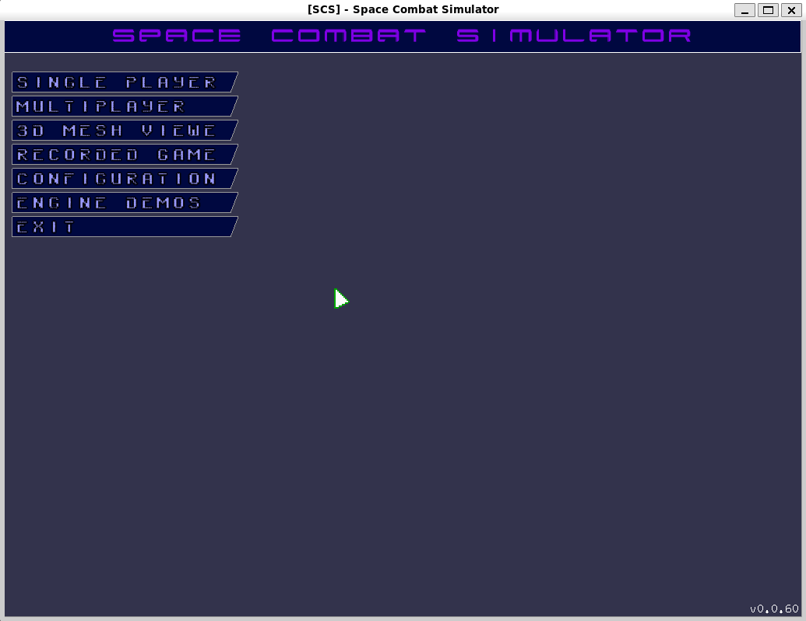
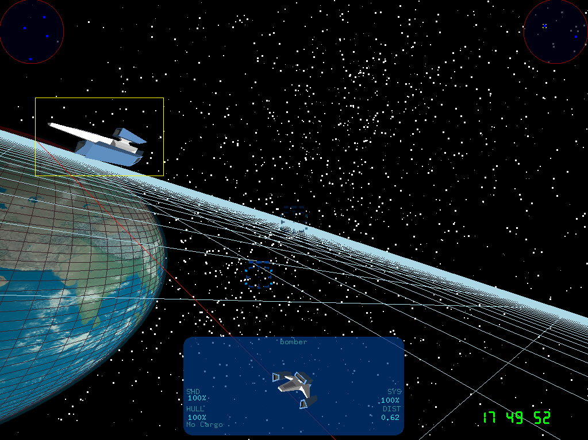
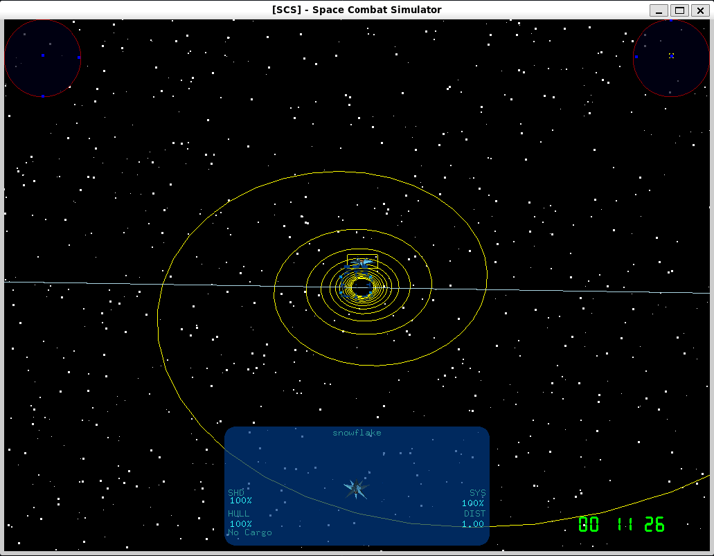
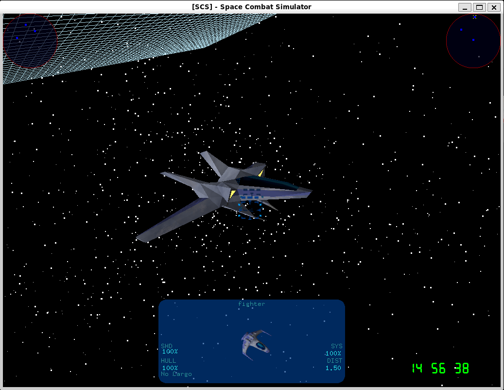
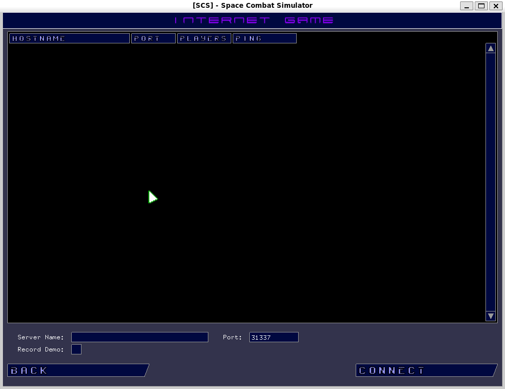
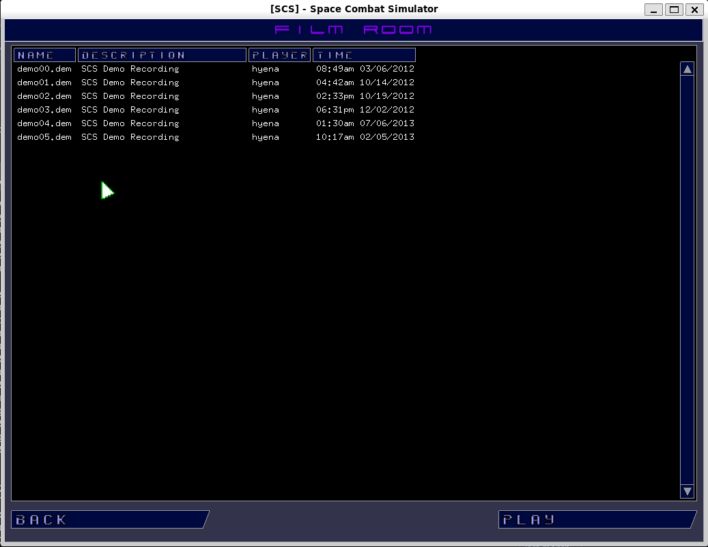
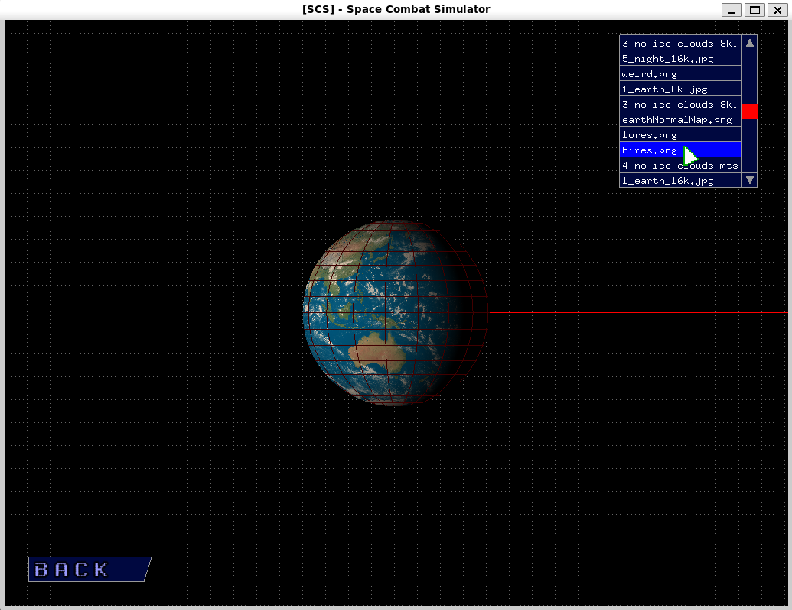
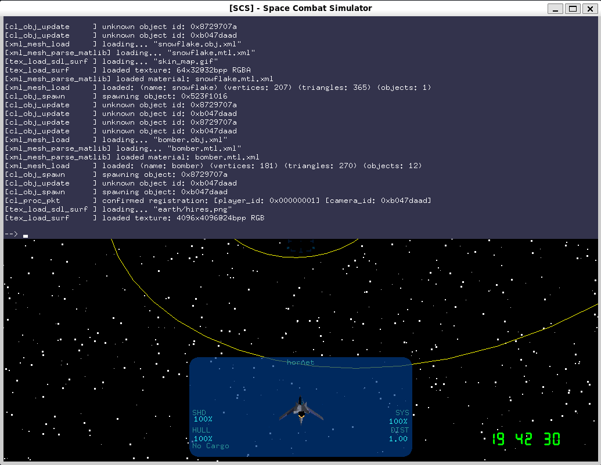

SCS - Space Combat Simulator
============================

Description:
------------

Space Combat Simulator is a multiplayer space dogfight video game that allows players to take control of a variety of spaceships and battle each other in intense dogfights. The game features a variety of maps, ships, and weapons, and players can customize their ships to their liking. Space Combat Simulator is a fast-paced and action-packed game that is sure to appeal to fans of space combat games.

Here are some additional details about the game:

* The game is set in a vast universe with a variety of planets and star systems to explore.
* Players can choose from a variety of spaceships, each with its own unique strengths and weaknesses.
* The game features a variety of weapons, including lasers, missiles, and torpedoes.
* Players can customize their ships with a variety of upgrades, including new weapons, engines, and shields.
* The game supports multiplayer battles with up to 16 players.
* Space Combat Simulator is a challenging and rewarding game that is sure to provide hours of entertainment.


Downloading and Running:
------------------------

* Create the following file and name it: `pixelops.flatpakrepo`

```
[Flatpak Repo]
Title=PixelOps Games
Url=https://repo.pixelops.net/
GPGKey=LS0tLS1CRUdJTiBQR1AgUFVCTElDIEtFWSBCTE9DSy0tLS0tCgptRE1FYUZ4RmhCWUpLd1lCQkFIYVJ3OEJBUWRBTjNWdmdzRUZyY3o1bkQwWDQyTXBTVG9DcU9tV1ZydEhRQ1VVCnRRa0kzViswRW1waGMyOXVRSEJwZUdWc2IzQnpMbTVsZElpWkJCTVdDZ0JCRmlFRTJEYTV0a3k4VmtpdVN0OEMKN0VZUkE3Znl1YzBGQW1oY1JZUUNHd01GQ1FXam1vQUZDd2tJQndJQ0lnSUdGUW9KQ0FzQ0JCWUNBd0VDSGdjQwpGNEFBQ2drUTdFWVJBN2Z5dWMxemt3RCtOQ0xMcGdiWTZ4YXZtclMvdTZydS9wMFdyOCtoMWpTdW40NUp6TmJlClpDc0EvMHN0ejc0MHFQMHkrZXdwSGhpVnlyTUVsTC8wTGhOUjFVK09JNTYxUFpvTnVEZ0VhRnhGaEJJS0t3WUIKQkFHWFZRRUZBUUVIUU1HTytoR3Q0aDRIeHQxN0pERHAzWmIxOHprOFljanM4cW1GeWcxSmRKUktBd0VJQjRoNApCQmdXQ2dBZ0ZpRUUyRGE1dGt5OFZraXVTdDhDN0VZUkE3Znl1YzBGQW1oY1JZUUNHd3dBQ2drUTdFWVJBN2Z5CnVjMjNkZ0Q2QTVTdFdGRU5CTHU4SkRyZVlMczlNc1ZwZmVkR2FWazhTV2JLeTNaT05JTUJBT2xXQlNuYmYramkKMTdTamVZQjZhb0l3VGdaZGc4L2w1VFZzd2ZVMlVXc0wKPVJtdlYKLS0tLS1FTkQgUEdQIFBVQkxJQyBLRVkgQkxPQ0stLS0tLQo=
```

* Download and install SCS by running the following commands:
```
sudo flatpak remote-add --if-not-exists pixelops-games pixelops.flatpakrepo
```
```
flatpak install pixelops-games net.pixelops.scs
```

* Run SCS with the following command:
```
flatpak run net.pixelops.scs
```

Building and Installing:
------------------------

  System Requirements
  -------------------

  * Linux Operating System
  * gcc
  * binutils
  * make
  * glib-2.0 (development package)
  * libxml-2.0 (development package)
  * SDL-2 (development package)
  * SDL2\_image (development package)
  * openal (development package)

First install all the required packages, then:

	git clone https://github.com/jbhall78/scs.git
	cd scs
	make
	sudo make install

Screenshots:
------------

### Main Menu


### Targeted on a bomber with the grid and earth in the background.


### Targeted on a snowflake with a test loop in the background.


### Looking at some of the more advanced ships.


### Multiplayer!


### This game supports recording and playback of game sessions.

### Using the engine for something else...


### Game console


