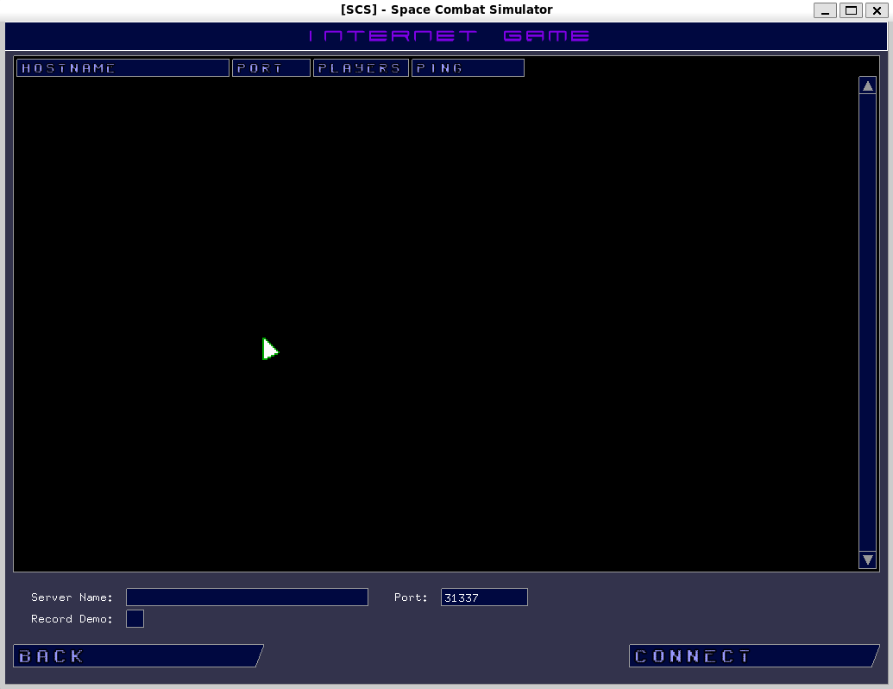

SCS - Space Combat Simulator
============================

Notice
------
⚠️  This game is experiencing bitrot, which is a degradation of digital data over time. Some of the libraries it uses are deprecated, which means that they are no longer supported by the software vendor. As a result, these libraries must be manually installed, which can be a time-consuming and error-prone process. I am working on reducing the number of outside dependencies this software requires, which will make it easier to maintain and update.

Description:
------------

Space Combat Simulator is a multiplayer space dogfight video game that allows players to take control of a variety of spaceships and battle each other in intense dogfights. The game features a variety of maps, ships, and weapons, and players can customize their ships to their liking. Space Combat Simulator is a fast-paced and action-packed game that is sure to appeal to fans of space combat games.

Here are some additional details about the game:

* The game is set in a vast universe with a variety of planets and star systems to explore.
* Players can choose from a variety of spaceships, each with its own unique strengths and weaknesses.
* The game features a variety of weapons, including lasers, missiles, and torpedoes.
* Players can customize their ships with a variety of upgrades, including new weapons, engines, and shields.
* The game supports multiplayer battles with up to 16 players.
* Space Combat Simulator is a challenging and rewarding game that is sure to provide hours of entertainment.

System Requirements
-------------------

* Linux Operating System
* build-essential
* libtool
* autoconf
* automake
* glib-2.0 (development package)
* libxml-2.0 (development package)
* SDL (development package)
* gnet-2.0 (development package) you will need 'bzr' to download this
* SDL\_image (development package)
* openal (development package)
* freealut (development package)

Building and Installing:
------------------------

	git clone https://github.com/jbhall78/scs.git
	cd scs
	make
	sudo make install

Screenshots:
------------

### Main Menu

### Targeted on a bomber with the grid and earth in the background.

### Targeted on a snowflake with a test loop in the background.

### Looking at some of the more advanced ships.

### Multiplayer!

### This game supports recording and playback of game sessions.

### Using the engine for something else...

### Game console

